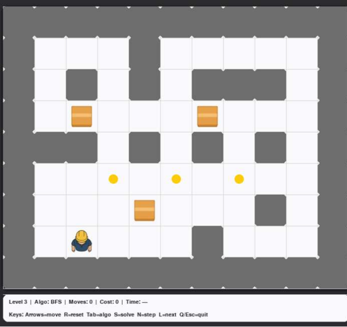

# AI-Powered Sokoban Solver 🤖📦

An intelligent agent that solves a dynamically modified version of the classic Sokoban puzzle. This project demonstrates the practical application of classical Artificial Intelligence search algorithms in a grid-based environment with variable path costs.

## 🌟 Overview
Unlike traditional Sokoban, this environment introduces dynamic path costs through new game elements: **Apples** and **Poisons**. The AI agent must not only find a path to push all boxes to their designated goals but also optimize for the lowest possible cost considering these temporary and permanent status effects.

### Dynamic Cost Mechanics:
* **Standard Move:** Cost = 1
* **Standard Box Push:** Cost = 5
* 🍎 **Apple (Buff):** Reduces the box push cost to `1` for the next 10 steps.
* ☠️ **Poison (Debuff):** Permanently adds `3` to all movement and push costs for the remainder of the level.

## 🧠 Implemented Algorithms
The core of this project is the decision-making engine. The following search algorithms were implemented from scratch to navigate the state space:

1.  **Breadth-First Search (BFS):** Guarantees the shortest path in terms of steps, but memory-intensive.
2.  **Depth-First Search (DFS):** Explores deep into the state tree; memory-efficient but not optimal.
3.  **Uniform Cost Search (UCS):** Finds the optimal path based on true cumulative cost ($g(n)$).
4.  **Greedy Best-First Search:** Uses a heuristic function to find the closest goal rapidly.
5.  **A* Search (A-Star):** The most balanced and optimal algorithm, combining true cost and heuristic estimates ($f(n) = g(n) + h(n)$).

### Heuristic Design & Deadlock Detection
For informed search algorithms (Greedy & A*), a custom heuristic function was developed. It calculates the Manhattan distance between boxes and goals, while incorporating a robust **Corner Deadlock Detection** system. States where boxes are pushed into unresolvable corners are heavily penalized (or skipped) to drastically reduce the search space and execution time.

## 🛠️ Technologies Used
* **Language:** Python 3.x
* **GUI Library:** Pygame
* **Concepts:** State-space modeling, Priority Queues (Min-Heap), Admissible Heuristics.

## 🚀 How to Run

1.  **Clone the repository:**
    ```bash
    git clone [https://github.com/parand1khalili/Sokoban-AI-Solver.git](https://github.com/parand1khalili/Sokoban-AI-Solver.git)
    cd Sokoban-AI-Solver
    ```

2.  **Install dependencies:**
    ```bash
    pip install -r requirements.txt
    ```

3.  **Run the game:**
    ```bash
    python main.py
    ```

## 🎮 Controls
* **Arrows (`↑`, `↓`, `←`, `→`):** Move the player manually.
* **`Tab`:** Cycle through the AI Algorithms (DFS, BFS, UCS, Greedy, A*).
* **`S`:** Solve the current level using the selected AI algorithm.
* **`N`:** Step forward through the AI's computed plan.
* **`L`:** Skip to the next level.
* **`R`:** Reset the current level.
* **`Q` / `Esc`:** Quit the game.

## 📸 Screenshot


---
*Developed as part of the Artificial Intelligence course at Amirkabir University of Technology.*