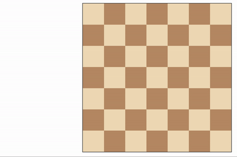

# Adversarial Isolation Game Agent ⚔️

An intelligent game-playing agent designed for a variation of the adversarial game **Isolation**, where players move like knights on a chessboard and must block their opponent from having available moves. This project demonstrates the practical application of minimax search, advanced pruning, and complex evaluation functions to master a game with a vast state space.

## 📺 Gameplay Visualization
Here is a sample match of the AI agent (playing as White 'w') in action:

## 🧠 AI Architecture & Algorithms
To achieve high-performance gameplay within strict time limits, the agent utilizes a combination of advanced game theory algorithms and heuristics:

### 1. Minimax Search with Alpha-Beta Pruning
The core decision-making is powered by the **Minimax** algorithm, allowing the agent to anticipate opponent responses and select moves leading to the most favorable outcome. To handle the game's high branching factor, **Alpha-Beta Pruning** was implemented to significantly cut down on the number of states explored without sacrificing optimality.

### 2. Iterative Deepening
Since moves must be decided within a tight time constraint, **Iterative Deepening** is used to progressively search deeper levels of the game tree. This ensures that the agent always has the best possible move ready if the time limit expires before completing the full search tree.

### 3. Custom Evaluation Functions
In the intermediate game states where the tree is too deep to reach a terminal leaf, the agent must estimate the "goodness" of a position. Several complex heuristic evaluation functions ($score = f(board\_state)$) were developed and compared:
* **Center Control:** Prioritizing squares that offer more move flexibility.
* **Opponent's Moves Minimization:** Aggressively reducing the number of spaces the opponent can jump to.
* **Combined Dynamics:** Weighted functions that adjust strategy based on whether it is early or late-game.

## 🛠️ Project Structure
* `game_agent.py`: The main engine containing the **Minimax**, **Alpha-Beta**, **Expectimax** (bonus) implementations, and the custom evaluation functions.
* `sample_players.py`: A set of baseline agents (Random, Open-Move, Improved) for testing against.
* `test.py`: A suite of automated tests to verify the correctness of search algorithms and heuristics.
* `visualize.py`: The script used to generate the HTML and GIF visualizations of the game.

## 📊 Performance Analysis
The included `report.pdf` provides a detailed analysis comparing the win rates of the various implemented heuristics against baseline agents. It also discusses the impact of search depth and pruning efficiency on the agent's performance.

---
*This project is part of the Artificial Intelligence curriculum at Amirkabir University of Technology.*