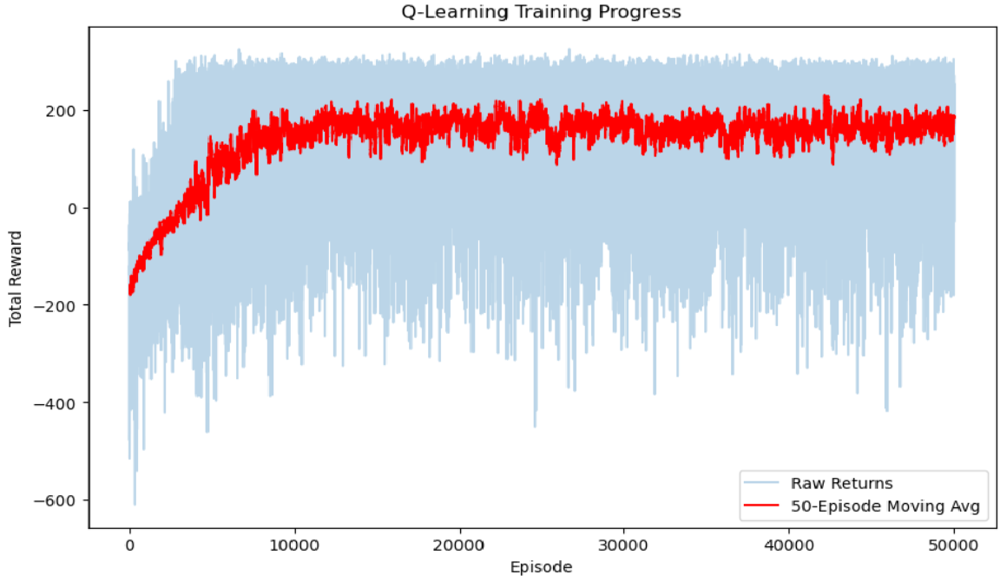

# Reinforcement Learning & MDP Solver 🚀

This project explores the fundamental concepts of Reinforcement Learning (RL) through two distinct lenses: solving a discrete **GridWorld MDP** using Dynamic Programming and mastering the continuous **Lunar Lander** environment using Q-Learning with state discretization.

## 🌕 Part 1: Lunar Lander (Q-Learning)
The challenge involves landing a lunar module safely on a landing pad between two flags. This environment is particularly challenging due to its continuous state space and sensitive dynamics.

### 🧠 Key Technical Implementations:
*  **State Discretization (Binning):** Since the environment is continuous, I designed a custom binning strategy to map variables (position, velocity, angle) into discrete states for effective Q-Table management.
*  **Q-Learning Algorithm:** Implemented off-policy Temporal Difference (TD) control to learn the optimal action-value function.
*  **Epsilon-Greedy Strategy:** Utilized a decaying epsilon ($\epsilon$) over **50,000 episodes** to balance exploration and exploitation.
*  **Reward Analysis:** Optimized landing performance by penalizing excessive fuel use and crashes while rewarding soft landings.

### 📉 Training Performance
Below is the learning curve showing the reward convergence over episodes, illustrating the transition from random behavior to consistent soft landings:




## 🗺️ Part 2: GridWorld MDP (Dynamic Programming)
 A rigorous implementation of Markov Decision Processes (MDP) on a 4x4 GridWorld environment.

### 🛠️ Algorithms Implemented:
1.   **Value Iteration:** Iterative calculation of the state-value function $V(s)$ until optimal convergence.
2.   **Policy Iteration:** A two-stage process of policy evaluation and improvement to reach the optimal policy.
3.   **Bellman Equations:** Core mathematical framework used to define and solve the utilities of each state.

## 📁 Project Structure
* `RL-lunarlander.ipynb`: Full implementation, training loops, and visualization code.
*  `report.pdf`: Detailed analytical report (in Persian) covering discretization logic and MDP modeling.
* `trained_agent.mp4`: Recorded performance of the final greedy policy.

## 🚀 Installation & Requirements
```bash
pip install gymnasium[box2d] numpy matplotlib imageio